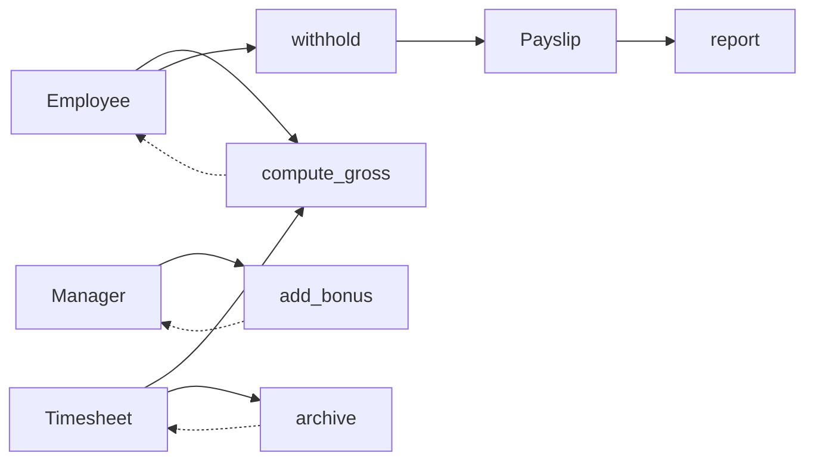

# Modules and workflows

A module is a function with `@module` on it. That's the entire authoring interface — no base class, no
abstract methods, no registration.

```python
@module
def compute_gross(
    employees: list[Employee],
    sheets: list[Timesheet],
    policy: PayrollPolicy,
) -> list[Patch[Employee]]: ...
```

The decorator reads the annotations **at import time** and builds the contract. A bad signature fails when
the module is imported, not when the workflow reaches it.

## Injection rules (parameters)

| Annotation | Receives | Error |
|---|---|---|
| `list[X]`, `X: Entity` | `store.all(X)` — a list, possibly empty | `TypeError` if `X` is not an `Entity` |
| `X`, `X: Config` | the step's config, else `store.one(X)` | `LookupError` if missing / ambiguous |
| missing | — | `TypeError` at declaration |
| other (`dict`, `str`, `Store`, …) | — | `TypeError` at declaration |

Two shapes, deliberately. There is no way to ask for one entity by name, a filtered subset, or the store
itself — see [Non-goals](non-goals.md).

An empty list is a normal input, not an error: a payroll run with no managers gives `add_bonus` an empty
list and it returns no patches.

### Isolation

Injected values are **deep-copied** by default. A module can sort them, mutate them, tear them apart —
none of it reaches the shared state.

```python
@module
def sneaky(employees: list[Employee]) -> None:
    employees[0].gross = 999.0  # no effect


Workflow(sneaky).run(store)
store.find(Employee, "ada").gross  # unchanged
```

This is what makes modules safe to write in isolation: the only way to change anything is to say so in the
return type. `Workflow.run(copy_inputs=False)` turns the copy off when volume demands it — the guarantee
then disappears, and that's a conscious choice, not a default.

## Output rules (return value)

The return annotation is **required** and forms the output contract.

| Return | Effect |
|---|---|
| `None` | No change. Read-only module: export, monitoring, metrics. |
| an `Entity` / a `Config` | Upsert. |
| an iterable of `Entity` / `Config` / `Patch` / `Delete` | Applied in order. |

```python
-> list[Payslip]                        # creates / replaces Payslip instances
-> list[Patch[Employee]]                # updates a few fields
-> list[Delete[Timesheet]]              # deletes
-> list[Payslip | Delete[Timesheet]]    # several types, several operations
-> None                                 # touches nothing
```

Returning something the signature doesn't declare is a `TypeError`:

```text
TypeError: undeclared returned Patch(Employee(name='ada'), gross)
           but Patch[Employee] is not in its return type
```

### Produced versus touched

The contract draws a distinction the checker relies on:

- **produced** (`-> list[Payslip]`): the type may not exist yet — this step brings it into being;
- **touched** (`Patch[X]`, `Delete[X]`): the type must already be there, in the initial store or from an
  upstream step.

That's the whole basis of [validation](validation.md).

### Application semantics

- A step's outputs are **collected, validated, then applied**. A step never applies halfway.
- Application order is return order. A `put` then a `Delete` on the same object leaves it deleted.
- Returning a full entity **replaces** any object under the same `(type, name)`. Partial updates go
  through `Patch`.

## `Step` — per-step configuration

A workflow can run **the same module twice with different parameters**. Configs therefore live on the
step, not on the module:

```python
class ReportPolicy(Config):
    detailed: bool = False


@module
def report(slips: list[Payslip], policy: ReportPolicy) -> None: ...


Workflow(
    compute_gross,
    withhold,
    Step(report, ReportPolicy(detailed=False), name="summary"),
    Step(report, ReportPolicy(detailed=True), name="audit_log"),
)
```

- `Step(module, *configs, name=None)` — `name` defaults to the function's name, suffixed on collision
  (`report`, `report_2`).
- Resolving a `Config`: the step's configs first, then `store.one(...)`.
- A bare module passed to `Workflow` is equivalent to `Step(module)`.

A config bound to a step is the right default for anything that varies *per occurrence*. Put it in the
store when it's genuinely global to the run.

## `Workflow`

| Method | Effect |
|---|---|
| `run(store, *, copy_inputs=True, on_step=None, reuse=None)` | `check`, then runs the steps in order. Returns the mutated store. |
| `check(store)` | Validates the chaining without running anything. |
| `explain()` | One line per step: reads, produced and `~`touched types. |
| `to_mermaid()` | The same dataflow as a Mermaid flowchart. |

### The order is yours

`Workflow` is a list, not a scheduler. It will not reorder your steps, and it does not try to infer a
dependency graph. What it guarantees is that an order which *cannot* work is rejected before anything
runs.

That distinction matters: `check` catches a step reading a type nobody provides. It does **not** catch a
step reading a type that exists but hasn't been computed yet — running `add_bonus` before `compute_gross`
is a silent mistake, because both types are in the store from the start. See
[what check does not catch](validation.md#what-check-does-not-catch).

### `to_mermaid` — export the graph

`explain()` reads well line by line; `to_mermaid()` renders the same `reads`/`produces`/`touches` edges as
a graph, for a reviewer who won't open the code:

```python
print(Workflow(compute_gross, add_bonus, withhold, archive, report).to_mermaid())
```



A solid arrow is a read (`Type --> step`) or a production (`step --> Type`); a dashed arrow is a `Patch` or
`Delete` (`step -.-> Type`). It is generated from the signatures, so it cannot go stale.

### `on_step` — the observability hook

```python
workflow.run(store, on_step=lambda step, ops, store: log.info("%s: %s", step.name, [repr(o) for o in ops]))
```

```text
compute_gross: ["Patch(Employee(name='ada'), gross)", "Patch(Employee(name='bob'), gross)"]
add_bonus:     []
withhold:      ["Payslip(name='p_ada')", "Payslip(name='p_bob')"]
archive:       ["Delete(Timesheet(name='ada-w1'))", "Delete(Timesheet(name='bob-w1'))"]
```

Called after each step is applied, with the operations it just wrote — `ops` is the list the module
returned, already validated. `add_bonus` running empty is visible directly, instead of two identical
`Store(...)` lines. One hook covers logs, metrics, provenance, progress bars, intermediate snapshots and
writing outputs to disk — see [Recipes](recipes.md).

### `reuse` — skip steps whose inputs haven't changed

A step's inputs are typed and pydantic, therefore comparable. `reuse` takes advantage of that: pass in a
previous `workflow.last_run`, and a step whose reads are identical to that run is skipped — its outcome is
restored from an in-memory snapshot instead of calling the module again.

```python
workflow.run(store)
# ... edit compute_gross ...
workflow.run(loaded_store(), reuse=workflow.last_run)  # add_bonus, withhold, archive: skipped
```

The first step whose reads differ, and every step after it, runs for real — a downstream step reading
unchanged data still counts as unchanged, even if an upstream step re-ran and happened to produce the same
values. In-memory only, for the lifetime of the `Workflow` object: nothing is written to disk, and there is
no invalidation to configure.
